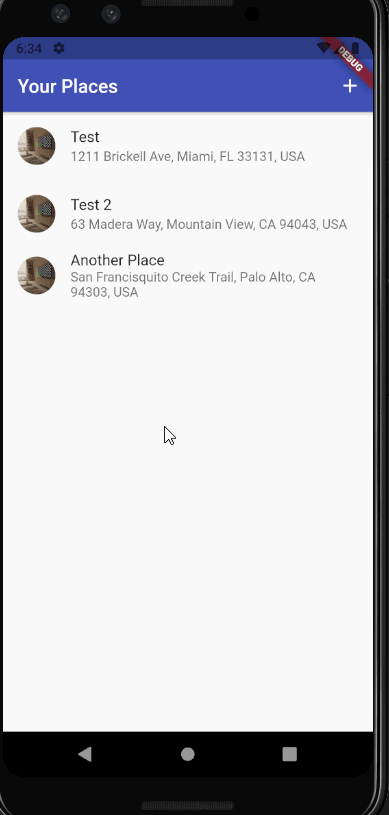

# Great Places

An app where you can save picture of places that you have visited.

## Info

This project is build with flutter...

In this project you are able to take a picture and add a place on google maps where the picture was taken.

- You can see all the places you have created.
- You can select all places and see a detail view of the place.
- You can view places created on a map.
- You can create places
- You can add title, picture, and google maps location
- You can select your current location or a custom one on the map
- you can save the places

## Video Walkthrough

Here's a walkthrough of implemented user stories:

GIF created with [LiceCap](http://www.cockos.com/licecap/). 
